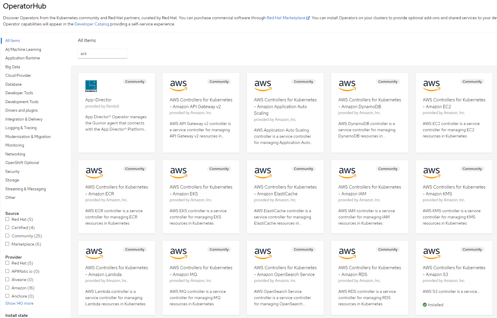

[AWS Controllers for Kubernetes](https://aws-controllers-k8s.github.io/community/experts/community/overview/) (ACK) lets you define and use AWS service resources directly from Kubernetes. With ACK, you can take advantage of AWS-managed services for your Kubernetes applications without needing to define resources outside of the cluster or run services that provide supporting capabilities like databases or message queues within the cluster.

ROSA clusters have a set of the ACK controllers in Operator Hub which makes it relatively easy to get started and use it. Caution should be taken as it is a tech preview product from AWS.

This tutorial shows how to use the ACK S3 controller as an example, but can be adapted for any other ACK controller that has an operator in the OperatorHub of your cluster.

## Prerequisites

* A ROSA cluster
* AWS CLI
* OpenShift CLI `oc`


## Pre-install instructions

1. Set some useful environment variables

   ```bash
   export CLUSTER=ansible-rosa
   export NAMESPACE=ack-system
   export IAM_USER=${CLUSTER}-ack-controller
   export S3_POLICY_ARN=arn:aws:iam::aws:policy/AmazonS3FullAccess
   export SCRATCH_DIR=/tmp/ack
   export ACK_SERVICE=s3
   export AWS_PAGER=""
   mkdir -p $SCRATCH_DIR
   ```

1. Create and bind an IAM service account for ACK to use

   ```bash
   aws iam create-user --user-name $IAM_USER
   ```

1. Create an access key for the user

   ```bash
   read -r ACCESS_KEY_ID ACCESS_KEY < <(aws iam create-access-key \
     --user-name $IAM_USER \
     --query 'AccessKey.[AccessKeyId,SecretAccessKey]' --output text)
   ```

1. Find the ARN of the recommended IAM policy

  > Note: you can find the recommended policy in each projects github repo, example https://github.com/aws-controllers-k8s/s3-controller/blob/main/config/iam/recommended-policy-arn

   ```bash
   aws iam attach-user-policy \
       --user-name $IAM_USER \
       --policy-arn "$S3_POLICY_ARN"
   ```

## Install the ACK S3 Controller

1. Log into your OpenShift console, click to OperatorHub and search for "ack"

  

1. Select the S3 controller and install it.

1. Create a config map for ACK to use

   ```bash
   cat <<EOF > $SCRATCH_DIR/config.txt
   ACK_ENABLE_DEVELOPMENT_LOGGING=true
   ACK_LOG_LEVEL=debug
   ACK_WATCH_NAMESPACE=
   AWS_REGION=us-west-2
   AWS_ENDPOINT_URL=
   ACK_RESOURCE_TAGS=$CLUSTER_NAME
   EOF
   ```

1. Apply the config map

   ```bash
   oc create configmap --namespace ack-system \
     --from-env-file=$SCRATCH_DIR/config.txt ack-s3-user-config
   ```

1. Create a secret for ACK to use

   ```bash
   cat <<EOF > $SCRATCH_DIR/secrets.txt
   AWS_ACCESS_KEY_ID=$ACCESS_KEY_ID
   AWS_SECRET_ACCESS_KEY=$ACCESS_KEY
   EOF
   ```

1. Apply the secret

   ```bash
   oc create secret generic --namespace ack-system \
     --from-env-file=$SCRATCH_DIR/secrets.txt ack-s3-user-secrets
   ```

1. Check the `ack-s3-controller` is running

   ```bash
   kubectl -n ack-system get pods
   ```

   ```bash
   NAME                              READY   STATUS    RESTARTS   AGE
   ack-s3-controller-6dc4b4c-zgs2m   1/1     Running   0          145m
   ```

1. If its not, restart it so that it can read the new configmap/secret.

   ```bash
   kubectl rollout restart deployment ack-s3-controller
   ```

1. Deploy an S3 Bucket Resource

   ```bash
   cat << EOF | oc apply -f -
   apiVersion: s3.services.k8s.aws/v1alpha1
   kind: Bucket
   metadata:
     name: $CLUSTER-bucket
   spec:
     name: $CLUSTER-bucket
   EOF
   ```

1. Verify the S3 Bucket Resource

   ```bash
   aws s3 ls | grep  $CLUSTER-bucket
   ```

   ```
   2022-06-02 12:20:25 ansible-rosa-bucket
   ```
