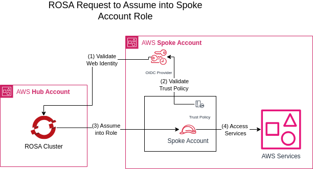

## Access AWS Cross Account resources using OIDC

When employing ROSA, a common enterprise pattern involves establishing a cluster in a centralized AWS account while enabling development teams to manage services in their respective AWS accounts. This necessitates granting the ROSA cluster access to services residing in AWS accounts different from its own.

Various approaches exist to address this challenge, but one straightforward method is to establish a secondary OIDC provider in the AWS account of the development team, enabling direct access for pods.

## Architecture

During the default STS ROSA Cluster creation, an "OpenID Connect Provider" is automatically generated in the same account as the cluster. This provider facilitates the ability of pods within our cluster to assume IAM Roles on the AWS Account using STS.

To enable pods to assume roles in other AWS accounts, we will essentially duplicate this OIDC Provider in the target account.

For clarity in this context, we will designate the AWS account housing our ROSA cluster as the **Hub Account** and the development team's AWS account, containing the AWS resources we aim to access, as the **Spoke Account**.



## Prerequisites

* [A ROSA cluster deployed with STS](/experts/rosa/sts/) - **Hub Account**
* Secondary AWS Account (no cluster required) - **Spoke Account**
* Helm 3
* aws CLI
* oc CLI
* jq

### Preparing Environment

1. Validate that your cluster has STS

    ```bash
    oc get authentication.config.openshift.io cluster -o json \
      | jq .spec.serviceAccountIssuer
    ```

    You should see something like the following, if not you should not proceed, instead look to the [Red Hat documentation on creating an STS cluster](https://docs.openshift.com/rosa/rosa_getting_started_sts/rosa_creating_a_cluster_with_sts/rosa-sts-creating-a-cluster-quickly.html).

    ```txt
    "https://xxxxx.cloudfront.net/xxxxx"
    ```

2. Create environment variables on **Hub Account** to refer to later

    ```bash
    export REGION=us-east-2
    export HUB_ACCOUNT_ID=`aws sts get-caller-identity --query Account --output text`
    export OIDC_ENDPOINT=$(oc get authentication.config.openshift.io cluster \
      -o jsonpath='{.spec.serviceAccountIssuer}' | sed  's|^https://||')
    ```

3. Create environment variables on **Spoke Account** to refer to later

    ```bash
    export REGION=us-east-2
    export SPOKE_ACCOUNT_ID=`aws sts get-caller-identity --query Account --output text`
    ```

## Create ODIC Provider on the Spoke Account

1. Obtain the ARN for the OpenID Connect associated with your Openshift Environment from the **Hub Account**

    Find using the list from command below:

    ```bash
    aws iam list-open-id-connect-providers
    ```

    {}If multiple ARNs exist use `aws iam get-open-id-connect-provider --open-id-connect-provider-arn <ARN>` to find the one that includes `openshift` in the client list.{}

    ```bash
    export OIDC_ARN = <OIDC's ARN>
    ```

1. Obtain the OIDC thumbprint from the OIDC Provider in the **Hub Account**

    ```bash
    export OIDC_THUMBPRINT=$(aws iam get-open-id-connect-provider --open-id-connect-provider-arn $OIDC_ARN --query ThumbprintList --output text)
    echo $OIDC_THUMBPRINT
    ```

1. On the **Spoke Account** create a new OpenID Connect Provider file using the values obtained from the hub account

    >Important: Make sure the `OIDC_ENDPOINT` and `OIDC_THUMBPRINT` variables have been transferred from the hub to spoke account

    ```bash
    aws iam create-open-id-connect-provider \
      --url https://${OIDC_ENDPOINT} --thumbprint-list $OIDC_THUMBPRINT \
      --client-id-list "sts.amazonaws.com"
    ```

## Create Trust Policy between Provider and IAM Role

1. Create IAM Role trust policy document the **Spoke Account**

    ```json
    cat <<EOF > trust-policy-spoke.json
    {
      "Version": "2012-10-17",
      "Statement": [
      {
      "Effect": "Allow",
      "Condition": {
        "StringEquals" : {
          "${OIDC_ENDPOINT}:sub": ["system:serviceaccount:my-application-ca:default"]
        }
      },
      "Principal": {
        "Federated": "arn:aws:iam::${SPOKE_ACCOUNT_ID}:oidc-provider/${OIDC_ENDPOINT}"
      },
      "Action": "sts:AssumeRoleWithWebIdentity"
      }
      ]
    }
    EOF
    cat trust-policy-spoke.json
    ```

1. Create IAM Role on **Spoke Acocunt**

    ```bash
    SPOKE_ROLE_ARN=$(aws iam create-role --role-name spoke-account-role \
      --assume-role-policy-document file://trust-policy-spoke.json \
      --query Role.Arn --output text)
    echo $SPOKE_ROLE_ARN
    ```

## Create Test Application

Verify our capability to assume the role established in our spoke account using the recently generated OIDC provider.

1. Create an OpenShift project

    ```bash
    oc new-project my-application-ca
    ```

1. Annotate the default service account to use the STS Role

    ```bash
    oc annotate -n my-application-ca serviceaccount default \
      eks.amazonaws.com/role-arn=$SPOKE_ROLE_ARN
    ```

1. Create a Pod with the AWS CLI

    ```yaml
    cat << EOF | oc apply -f -
    apiVersion: v1
    kind: Pod
    metadata:
      name: my-application-ca2
      labels:
        app: my-application-ca
    spec:
      volumes:
        - name: aws-config
          configMap:
            name: aws-config
      containers:
      - name: my-application-ca
        image: quay.io/jland/aws-cli:2.8.12
        command:
          - /bin/bash
          - '-c'
          - '--'
        args:
          - aws sts get-caller-identity && while true; do sleep 30; done
    EOF
    ```

1. Verify the Pod is using the correct AWS identity

    ```bash
    oc exec -it my-application-ca -- aws sts get-caller-identity
    ```

{}Should be showing the role we created in our Spoke Account{}

## Stretch Goal

Utilize the previously established custom OIDC provider to finalize the [AWS Secrets Experts Article](/experts/rosa/ecr-secret-operator), where the SecretManager secret is stored in your **Spoke Account**.

## Cleanup

1. Delete application

    ```bash
    oc delete project my-application-ca
    ```

2. Delete AWS Roles and Policies on the **Spoke Account**

    ```bash
    aws iam list-open-id-connect-providers
    aws iam delete-open-id-connect-provider --open-id-connect-provider-arn <SPOKE ACCOUNT OIDC ARN>
    aws iam delete-role --role-name spoke-account-role
    ```
