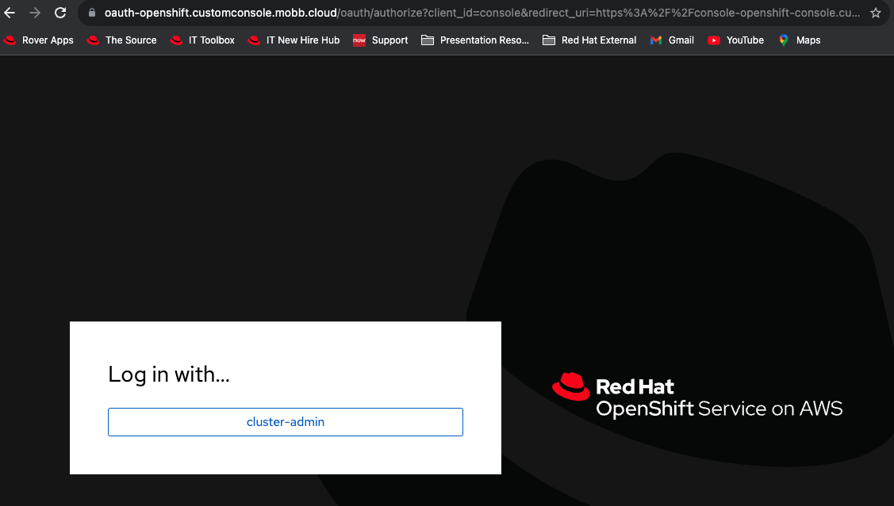
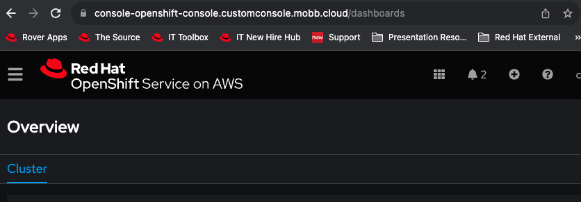

Starting with ROSA 4.14.X, it is possible to modify the hostname and TLS certificate of component Routes post-install. These are the `OAuth`, `Console`, and `Downloads` routes. For example, the default ROSA console uses the built-in domain `https://console-openshift-console.apps.<cluster_name>.<random>.p1.openshiftapps.com`. You can now specify a custom domain, for example `test.example.com`, and the ROSA console will be available at a URL such as `https://console-openshift-console.test.example.com`.   

## Prerequisites

* A Red Hat OpenShift for AWS (ROSA) cluster 4.14.0 or higher
* Cluster admin privileges (required to be able to modify cluster ingress)
* Route53 Hosted Zone
* A custom domain
* A wildcard certificate 
* `rosa` cli
* `oc` cli

## Deploy 

### Set up Environment

1. Set your email and domain
    
     ```bash
     export EMAIL=<YOUR-EMAIL>
     export DOMAIN=<YOUR-DOMAIN>
     ```

1. Set remaining environment variables 
   
     ```bash
     export SCRATCH_DIR=/tmp/scratch
     export ZONE_ID=$(aws route53 list-hosted-zones-by-name --output json \
     --dns-name "$DOMAIN." --query 'HostedZones[0]'.Id --out text | sed 's/\/hostedzone\///')
     mkdir -p $SCRATCH_DIR
     ```

### Custom Domain

1. Create TLS Key Pair for custom domain using certbot
 
    > Skip this step if you already have a key pair

   ```bash
   certbot certonly --manual \
     --preferred-challenges=dns \
     --email $EMAIL \
     --server https://acme-v02.api.letsencrypt.org/directory \
     --agree-tos \
     --config-dir "$SCRATCH_DIR/config" \
     --work-dir "$SCRATCH_DIR/work" \
     --logs-dir "$SCRATCH_DIR/logs" \
     -d "*.$DOMAIN"
   ```

1. Create a TLS secret for your custom domain in the openshift-config namespace

     ```bash
     CERTS=/tmp/scratch/config/live/$DOMAIN
     oc create secret tls acme-tls --cert=$CERTS/fullchain. pem --key=$CERTS/privkey.pem -n openshift-config
     ```

### Create wildcard DNS record and point to DNS entry of Ingress controller

1. Retrieve the cluster's default ingress id
     ```bash
     rosa list ingress -c <cluster_name>
     ```
     > Take note of the default ingress ID.  

1. Enable wildcard policy on the default ingress
     
    > Skip this step if you already have wildcard policy enabled on your cluster

     ```bash
     rosa edit ingress -c <cluster_name> <default-ingress_id> --wildcard-policy WildcardsAllowed
     ```

1. Retrieve the ROSA default ingress load balancer DNS name (can use the AWS console or run the command below)
     
     ```bash
     oc get services -n openshift-ingress | grep default
     ```
   or 

   

1. Add a wildcard DNS record in your custom domain Route53 Hosted Zone to CNAME to the router-default 

   

1. Edit the ingress controller to use custom route and certificate

     ```bash
     rosa edit ingress -c <cluster-id> <default-ingress-id> --cluster-routes-hostname <$DOMAIN> --cluster-routes-tls-secret-ref <tls-secret-created-for-custom-domain>
     ```


   **Important Note**: All routes created on the default ingress will be accessible on .$DOMAIN url


### Test
1. Retrieve ROSA console URL
   
     ```bash
     oc whoami --show-console
     ```

1. Navigate to your console domain in the browser to access the login page. 
 
   > The Oauth componentRoute is also accessible on the custom domain

   

1. Login to the console 

    
   
   
