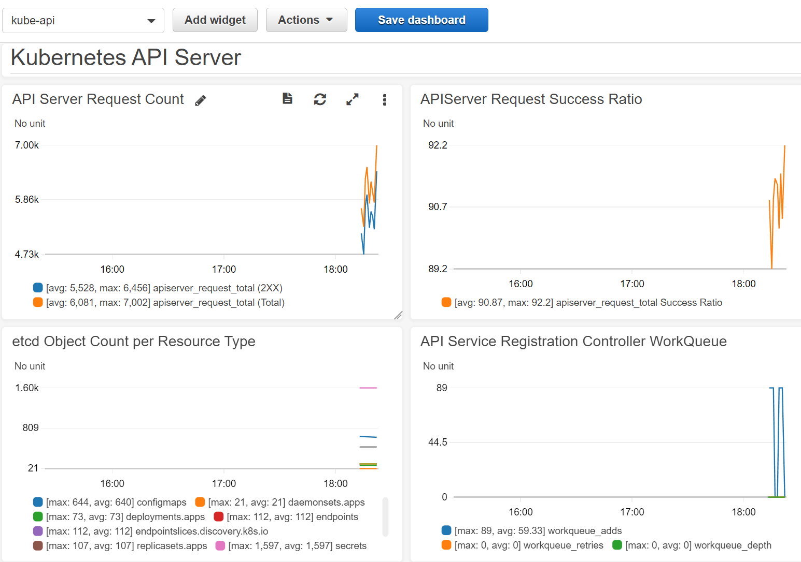

This document shows how you can use the AWS CloudWatch Agent to scrape Prometheus endpoints and publish metrics to CloudWatch in a Red Hat OpenShift Service on AWS (ROSA) cluster.

It pulls from the AWS documentation for installing the CloudWatch Agent to Kubernetes and publishes metrics for the Kubernetes API Server and provides a simple dashboard to view the results.

Currently the AWS CloudWatch Agent [does not support](https://github.com/aws/amazon-cloudwatch-agent/issues/187) pulling all metrics from the Prometheus federated endpoint, but the hope is that when it does we can ship all cluster and user workload metrics to AWS CloudWatch.

## Prerequisites

1. A Red Hat OpenShift Service on AWS (ROSA) cluster
1. The OpenShift CLI (`oc`)
1. The `jq` command-line interface (CLI)
1. The Amazon Web Services (AWS) CLI (`aws`)

## Setting up your environment

1. Ensure you are logged into your cluster with the OpenShift CLI (`oc`) and your AWS account with the AWS CLI (`aws`).

1. Configure the following environment variables:
   ```bash
   export ROSA_CLUSTER_NAME=$(oc get infrastructure cluster -o=jsonpath="{.status.infrastructureName}"  | sed 's/-[a-z0-9]\{5\}$//')
   export REGION=$(rosa describe cluster -c ${ROSA_CLUSTER_NAME} --output json | jq -r .region.id)
   export OIDC_ENDPOINT=$(oc get authentication.config.openshift.io cluster -o json | jq -r .spec.serviceAccountIssuer | sed  's|^https://||')
   export AWS_ACCOUNT_ID=`aws sts get-caller-identity --query Account --output text`
   export AWS_PAGER=""
   export SCRATCH="/tmp/${ROSA_CLUSTER_NAME}/cloudwatch-agent-metrics"
   mkdir -p ${SCRATCH}
   ```

1. Ensure all fields output correctly before moving to the next section:
   ```bash
   echo "Cluster: ${ROSA_CLUSTER_NAME}, Region: ${REGION}, OIDC Endpoint: ${OIDC_ENDPOINT}, AWS Account ID: ${AWS_ACCOUNT_ID}"
   ```

## Preparing your AWS account

1. Create an IAM role trust policy for the CloudWatch Agent service account to use:
   ```bash
   cat <<EOF > ${SCRATCH}/trust-policy.json
   {
      "Version": "2012-10-17",
      "Statement": [{
      "Effect": "Allow",
      "Principal": {
         "Federated": "arn:aws:iam::${AWS_ACCOUNT_ID}:oidc-provider/${OIDC_ENDPOINT}"
      },
      "Action": "sts:AssumeRoleWithWebIdentity",
      "Condition": {
         "StringEquals": {
            "${OIDC_ENDPOINT}:sub": "system:serviceaccount:amazon-cloudwatch:cwagent-prometheus"
         }
      }
      }]
   }
   EOF
   ```
1. Create an IAM role for the CloudWatch Agent to assume:
   ```bash
   ROLE_ARN=$(aws iam create-role --role-name "${ROSA_CLUSTER_NAME}-cloudwatch-agent" \
         --assume-role-policy-document file://${SCRATCH}/trust-policy.json \
         --query Role.Arn --output text)
   echo ${ROLE_ARN}
   ```

1. Attach the AWS-managed `CloudWatchAgentServerPolicy` IAM policy to the IAM role:

   ```bash
   aws iam attach-role-policy --role-name "${ROSA_CLUSTER_NAME}-cloudwatch-agent" --policy-arn "arn:aws:iam::aws:policy/CloudWatchAgentServerPolicy"
   ```

## Deploy the AWS CloudWatch Agent

1. Create a project for the AWS CloudWatch Agent:

   ```bash
   oc new-project amazon-cloudwatch
   ```

1. Create a ConfigMap with the Prometheus CloudWatch Agent config:

   ```yaml
   cat << EOF | oc apply -f -
   apiVersion: v1
   kind: ConfigMap
   metadata:
     name: prometheus-cwagentconfig
     namespace: amazon-cloudwatch
   data:
     cwagentconfig.json: |
       {
         "agent": {
           "region": "${REGION}",
           "debug": true
         },
         "logs": {
           "metrics_collected": {
             "prometheus": {
               "cluster_name": "${ROSA_CLUSTER_NAME}",
               "log_group_name": "/aws/containerinsights/${ROSA_CLUSTER_NAME}/prometheus",
               "prometheus_config_path": "/etc/prometheusconfig/prometheus.yaml",
               "emf_processor": {
                 "metric_declaration": [
                   {"source_labels": ["job", "resource"],
                     "label_matcher": "^kubernetes-apiservers;(services|daemonsets.apps|deployments.apps|configmaps|endpoints|secrets|serviceaccounts|replicasets.apps)",
                     "dimensions": [["ClusterName","Service","resource"]],
                     "metric_selectors": [
                     "^etcd_object_counts$"
                     ]
                   },
                   {"source_labels": ["job", "name"],
                     "label_matcher": "^kubernetes-apiservers;APIServiceRegistrationController$",
                     "dimensions": [["ClusterName","Service","name"]],
                     "metric_selectors": [
                     "^workqueue_depth$",
                     "^workqueue_adds_total$",
                     "^workqueue_retries_total$"
                     ]
                   },
                   {"source_labels": ["job","code"],
                     "label_matcher": "^kubernetes-apiservers;2[0-9]{2}$",
                     "dimensions": [["ClusterName","Service","code"]],
                     "metric_selectors": [
                     "^apiserver_request_total$"
                     ]
                   },
                   {"source_labels": ["job"],
                     "label_matcher": "^kubernetes-apiservers",
                     "dimensions": [["ClusterName","Service"]],
                     "metric_selectors": [
                     "^apiserver_request_total$"
                     ]
                   }
                 ]
               }
             }
           },
           "force_flush_interval": 5
         }
       }
   EOF
   ```

1. Create a ConfigMap for the Prometheus scrape config:

   ```yaml
   cat << EOF | oc apply -f -
   apiVersion: v1
   kind: ConfigMap
   metadata:
     name: prometheus-config
     namespace: amazon-cloudwatch
   data:
     # prometheus config
     prometheus.yaml: |
       global:
         scrape_interval: 1m
         scrape_timeout: 10s
       scrape_configs:
         - job_name: 'kubernetes-apiservers'
           kubernetes_sd_configs:
             - role: endpoints
               namespaces:
                 names:
                   - default
           scheme: https
           tls_config:
             ca_file: /var/run/secrets/kubernetes.io/serviceaccount/ca.crt
             insecure_skip_verify: true
           bearer_token_file: /var/run/secrets/kubernetes.io/serviceaccount/token
           relabel_configs:
           - source_labels: [__meta_kubernetes_service_name, __meta_kubernetes_endpoint_port_name]
             action: keep
             regex: kubernetes;https
           - action: replace
             source_labels:
             - __meta_kubernetes_namespace
             target_label: Namespace
           - action: replace
             source_labels:
             - __meta_kubernetes_service_name
             target_label: Service
   EOF
   ```

1. Create a service account for the CloudWatch Agent to use and annotate it with the IAM role we created earlier:

   ```yaml
   cat << EOF | oc apply -f -
   apiVersion: v1
   kind: ServiceAccount
   metadata:
     name: cwagent-prometheus
     namespace: amazon-cloudwatch
     annotations:
       eks.amazonaws.com/role-arn: "${ROLE_ARN}"
   EOF
   ```

1. Create a cluster role and role binding for the service account:

   ```yaml
   cat << EOF | oc apply -f -
   apiVersion: rbac.authorization.k8s.io/v1
   kind: ClusterRole
   metadata:
     name: cwagent-prometheus-role
   rules:
     - apiGroups: [""]
       resources:
       - nodes
       - nodes/proxy
       - services
       - endpoints
       - pods
       verbs: ["get", "list", "watch"]
     - apiGroups:
       - extensions
       resources:
       - ingresses
       verbs: ["get", "list", "watch"]
     - nonResourceURLs: ["/metrics"]
       verbs: ["get"]

   ---
   apiVersion: rbac.authorization.k8s.io/v1
   kind: ClusterRoleBinding
   metadata:
     name: cwagent-prometheus-role-binding
   subjects:
     - kind: ServiceAccount
       name: cwagent-prometheus
       namespace: amazon-cloudwatch
   roleRef:
     kind: ClusterRole
     name: cwagent-prometheus-role
     apiGroup: rbac.authorization.k8s.io
   EOF
   ```

1. Allow the CloudWatch Agent to run with the `anyuid` security context constraint:

   ```bash
   oc -n amazon-cloudwatch adm policy add-scc-to-user anyuid -z cwagent-prometheus
   ```

1. Deploy the CloudWatch Agent pod:

   ```yaml
   cat << EOF | oc apply -f -
   apiVersion: apps/v1
   kind: Deployment
   metadata:
     name: cwagent-prometheus
     namespace: amazon-cloudwatch
   spec:
     replicas: 1
     selector:
       matchLabels:
         app: cwagent-prometheus
     template:
       metadata:
         labels:
           app: cwagent-prometheus
       spec:
         containers:
           - name: cloudwatch-agent
             image: amazon/cloudwatch-agent:1.247348.0b251302
             imagePullPolicy: Always
             resources:
               limits:
                 cpu:  1000m
                 memory: 1000Mi
               requests:
                 cpu: 200m
                 memory: 200Mi
             env:
               - name: CI_VERSION
                 value: "k8s/1.3.8"
               - name: RUN_WITH_IRSA
                 value: "True"
             volumeMounts:
               - name: prometheus-cwagentconfig
                 mountPath: /etc/cwagentconfig
               - name: prometheus-config
                 mountPath: /etc/prometheusconfig
         volumes:
           - name: prometheus-cwagentconfig
             configMap:
               name: prometheus-cwagentconfig
           - name: prometheus-config
             configMap:
               name: prometheus-config
         terminationGracePeriodSeconds: 60
         serviceAccountName: cwagent-prometheus
   EOF
   ```

1. Verify the CloudWatch Agent pod is `Running`:

   ```bash
   oc get pods -n amazon-cloudwatch
   ```
   Example output

   ```text
   NAME                                  READY   STATUS    RESTARTS   AGE
   cwagent-prometheus-54cd498c9c-btmjm   1/1     Running   0          60m
   ```

## Create Sample Dashboard in AWS CloudWatch

1. Download the Sample Dashboard

   ```bash
   wget -O ${SCRATCH}/dashboard.json https://raw.githubusercontent.com/rh-mobb/documentation/main/content/rosa/metrics-to-cloudwatch-agent/dashboard.json
   ```

1. Update the Sample Dashboard

   ```bash
   sed -i .bak "s/__CLUSTER_NAME__/${ROSA_CLUSTER_NAME}/g" ${SCRATCH}/dashboard.json
   sed -i .bak "s/__REGION_NAME__/${REGION}/g" ${SCRATCH}/dashboard.json
   ```

1. Browse to https://console.aws.amazon.com/cloudwatch

1. Create a Dashboard, and name it "Kubernetes API Server"

1. Click **Actions** and **View/edit source**

1. Run the following command and copy the JSON output into the text area:

   ```bash
   cat ${SCRATCH}/dashboard.json
   ```

1. After 5-10 minutes, view the dashboard and see the data flowing into CloudWatch:

   
