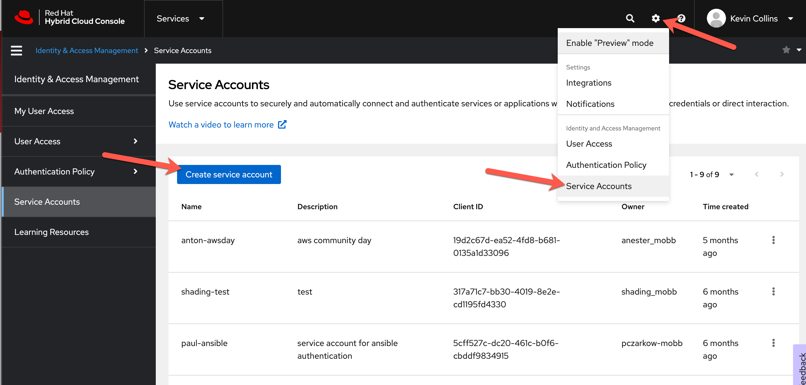
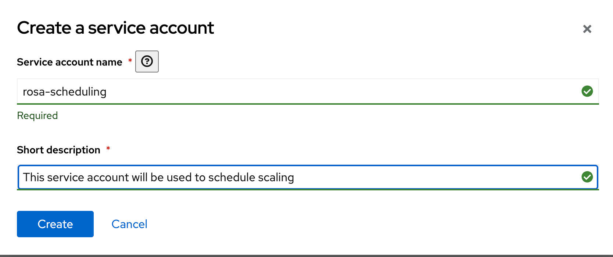
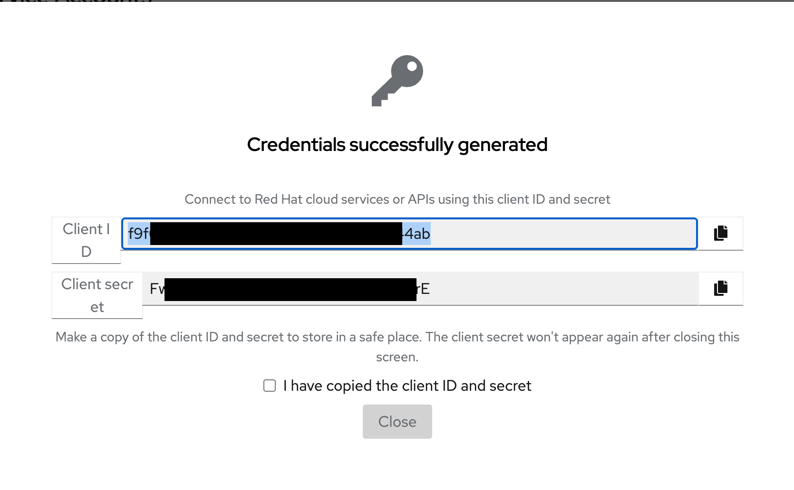
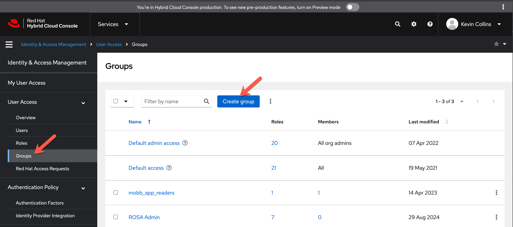
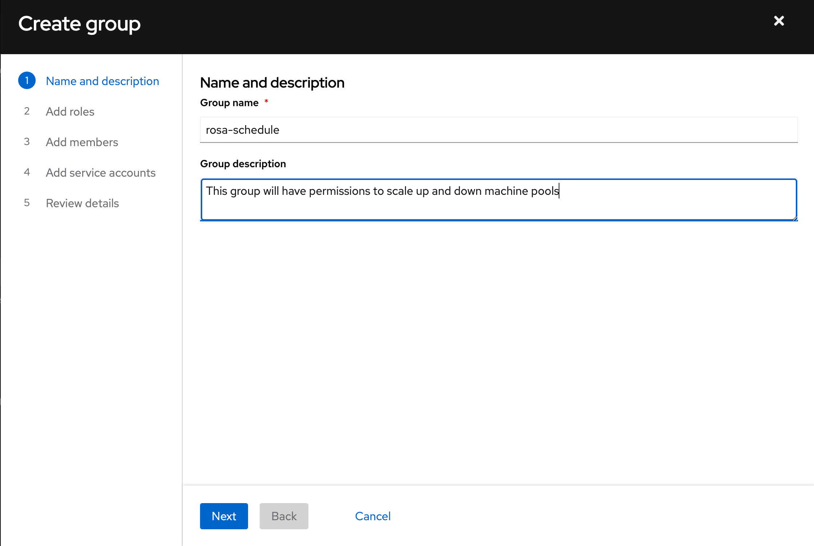
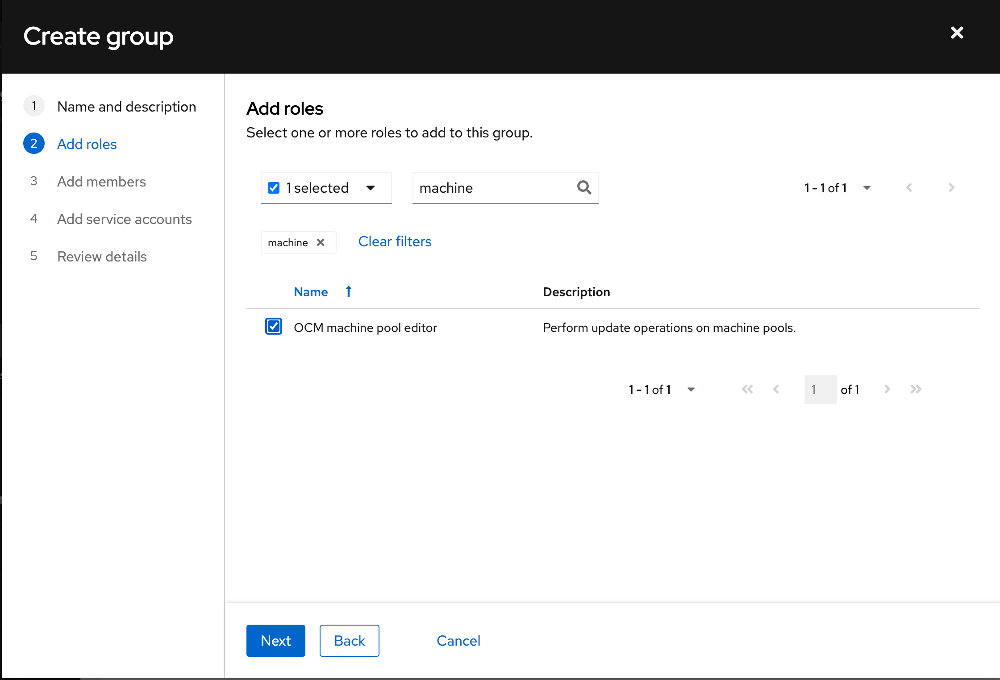
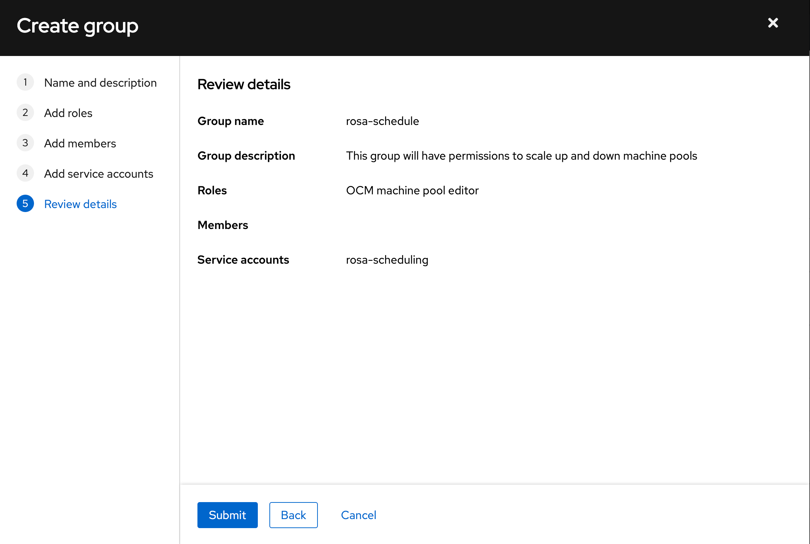

One of the key benefits of Red Hat OpenShift Service on AWS (ROSA) is its ability to scale efficiently, ensuring you only pay for the resources you actually need. While ROSA includes autoscaling features that adjust cluster size based on demand, you can further optimize costs by scheduling scaling during off-peak hours when the cluster isn’t heavily used. This helps reduce expenses without impacting performance.

In this guide, we’ll show you how to schedule scaling in ROSA, allowing your cluster to automatically adjust its size based on a predefined schedule. You'll learn how to schedule scale-downs during periods of low activity and scale-ups when additional resources are required, ensuring both cost efficiency and optimal performance.

ROSA clusters consist of multiple machine pools, each containing worker nodes. For example, each availability zone has its own machine pool, allowing for granular control over the cluster's worker node configuration. Since each machine pool can scale independently, you can fine-tune resource allocation based on workload demands.

This guide will walk you through scaling a single machine pool, a process that can be repeated for additional machine pools you wish to schedule scaling for.

## Prerequisites

The following three CLIs need to be installed and logged into.
* oc cli 
* rosa cli 
* aws cli
* podman cli
* jq
<br>

> Note: You must log into your ROSA cluster via your oc cli before going through the following steps.

## Prepare the Environment

This guide utilizes several environment variables that will be referenced throughout.

### Set cluster and AWS environment variables
```bash
export CLUSTER_NAME=rosa-cluster-name
export REGION=$(rosa describe cluster -c ${CLUSTER} -o json | jq -r '.region.id')
export OIDC_PROVIDER=$(rosa describe cluster -c ${CLUSTER_NAME} -o json \
 | jq -r .aws.sts.oidc_endpoint_url | sed -e 's/^https:\/\///')
export ACCOUNT=$(aws sts get-caller-identity --query 'Account' --output text)
export SCRATCH_DIR=~/tmp/rosa-scale
export OCP_SA=rosa-cli-sa #name of the OpenShift Service account that will be used to scale the cluster, this will be created during the tutorial
export OCP_PROJECT=rosa-cli #name of the OpenShift Service project that will be used to scale the cluster, this will be created during the tutorial
mkdir -p $SCRATCH_DIR
```
<br>

Retrieve the list of machine pool names:

```bash
rosa list machinepools -c $CLUSTER_NAME
```

Example output:

```
ID         AUTOSCALING  REPLICAS  INSTANCE TYPE  LABELS    TAINTS    AVAILABILITY ZONE  SUBNET                    DISK SIZE  VERSION  AUTOREPAIR
workers-0  No           1/1       m5.xlarge                          us-east-1a         subnet-0249b033beca653af  300 GiB    4.16.6   Yes
workers-1  No           7/7       m5.xlarge                          us-east-1c         subnet-068a2d36d792fe269  300 GiB    4.16.6   Yes
workers-2  No           2/2       m5.xlarge                          us-east-1b         subnet-0dfb05d8b5e946048  300 GiB    4.16.6   Yes
```

For this guide, we will use the first machine pool *workers-0*

Set the machine pool you want to scale and the minimum and maximum number of replicas as an environment variables.

```bash
export MACHINEPOOL=workers-0
export MIN_REPLICAS=2
export MAX_REPLICAS=4
```

### ROSA Token
Using Red Hat's Hybrid Cloud Console, you can create service accounts for automation tasks such as DevOps processes or, in this case, scheduling cluster scaling. One of the key benefits of service accounts in ROSA is the ability to restrict access to only what's necessary.

For scaling machine pools up and down, the service account we create will be granted access solely to machine pools, ensuring a least-privilege approach while keeping the cluster secure.

To get a service account, start by logging into [Red Hat's Hybrid Cloud Console](http://console.redhat.com)

Click on the gear button and then click create Servcie Account.


Give your service account a name and a short description.


On the next page, you will see the service account credentials.  Make sure to copy these down somewhere safe, this is the only time you will be able to see these credentials.


Next, we will create a group that will have permissions to adjust machine pool size.
On the left hand nav, click on Groups and then Create group.


Next, enter a name and description for the group.


Next, filter and search for "machine", then select the OCM Machine Pool Editor role. This will ensure that the service account, which we will add in the next step, has permissions limited to interacting only with machine pools.


Click next to skip the add members dialog and advance to the add service accounts dialog.
On the Add service accounts dialog, select the service account you created in the previous step.


Finally, on the last step, click on Submit and this will create the service account for you.


Next, log into rosa using the client-id and client-secret you generated in the previous step.

```bash
rosa login --client-id f9f0ed0...ab --client-secret Fwkq4wWo...rE
```

example output

```
Logged in as 'service-account-xxxxxxxxxxxxxxxxxxxxxx-03ed9f8d44ab' on 'https://api.openshift.com'
```

Next, generate a token for ROSA and set it as an environment variable.

```bash
rosa token
```

example output

```
rosa token
W: The current version (1.2.47) is not up to date with latest rosa cli released version (1.2.50).
W: It is recommended that you update to the latest version.
eyJhbGciOiJSUzI1NiIsInR5cCIgOiAiSl...
```

Set the output to an environment variable

```bash
export ROSA_TOKEN="eyJhbGciOiJSUzI1NiIsInR5cCIgOiAiSldU .... "
```

After retrieving the token, log back in with your normal ROSA credentails / token.

## Create AWS Policy
One of the standout features of ROSA is its integration with AWS STS, enabling fine-grained access control to AWS resources. By leveraging IAM Roles for Service Accounts (IRSA), we can extend this access control to applications running within the cluster, allowing them to securely interact with AWS resources while following least-privilege principles.

1. To do so, the first thing we need to do is create an AWS IAM Policy.

   ```bash
   cat << EOF > $SCRATCH_DIR/trust-policy.json
   {
    "Version": "2012-10-17",
    "Statement": [
        {
            "Effect": "Allow",
            "Principal": {
                "Federated": "arn:aws:iam::${ACCOUNT}:oidc-provider/${OIDC_PROVIDER}" 
            },
            "Action": "sts:AssumeRoleWithWebIdentity",
            "Condition": {
                "StringEquals": {
                    "${OIDC_PROVIDER}:sub": "system:serviceaccount:${OCP_PROJECT}:${OCP_SA}" 
                }
            }
        }
    ]
   }
   EOF
   ```

1. Create Role for the EFS CSI Driver Operator

   ```bash
   ROLE=$(aws iam create-role \
     --role-name "${CLUSTER_NAME}-scheduler" \
     --assume-role-policy-document file://$SCRATCH_DIR/trust-policy.json \
     --query "Role.Arn" --output text)
   echo $ROLE
   ```

1. Attach the Policies to the Role

   ```bash
   aws iam attach-role-policy \
      --role-name "${CLUSTER_NAME}-scheduler" \
      --policy-arn arn:aws:iam::aws:policy/ReadOnlyAccess
   ```

## Create OpenShift cronjob to schedule scaling

To schedule scaling of the worker nodes, we will create 2 cronjobs which will control when the cluster will be scheduled to be scaled up and scaled down.  The cronjob will leverage an image that contains the ROSA cli to adjust the machine pool sizes.

1. Create a new openshift project

    ```bash
    oc new-project ${OCP_PROJECT}
    ```

1. Create a service account that the cron job will run under, notice that it uses IRSA and the role we just created

    ```bash
    cat << EOF | oc apply -f - 
    apiVersion: v1
    kind: ServiceAccount
    metadata:
    name: $OCP_SA
    namespace: $OCP_PROJECT
    annotations: 
        eks.amazonaws.com/role-arn: $ROLE
    EOF
    ```

1. Create a secret that contains the ROSA Token for the service account you create previously

    ```bash
    oc create secret generic rosa-token --from-literal=ROSA_TOKEN=${ROSA_TOKEN}
    ```

1. Create a config map for the scaling up settings

    ```bash
    cat << EOF | oc apply -f -
    apiVersion: v1
    kind: ConfigMap
    metadata:
      name: ${CLUSTER_NAME}-${MACHINEPOOL}-scaleup
    data:
      CLUSTER_NAME: ${CLUSTER_NAME}
      MACHINEPOOL: ${MACHINEPOOL}
      REPLICAS: "${MAX_REPLICAS}"
    EOF
    ```

1. Create a config map for the scaling down settings
    ```bash
    cat << EOF | oc apply -f -
    apiVersion: v1
    kind: ConfigMap
    metadata:
      name: ${CLUSTER_NAME}-${MACHINEPOOL}-scaledown
    data:
      CLUSTER_NAME: ${CLUSTER_NAME}
      MACHINEPOOL: ${MACHINEPOOL}
      REPLICAS: "${MIN_REPLICAS}"
    EOF
    ```

1. Build and push a container image

   >note: this guide will use the internal image registry in the cluster, any image repository will work.

   Patch the registry so we can push images to it

   ```bash
   oc patch configs.imageregistry.operator.openshift.io/cluster --patch '{"spec":{"defaultRoute":true}}' --type=merge
   ```
   
   Retrieve the image registry URL

   ```bash
   export REGISTRY_URL=$(oc get route default-route -n openshift-image-registry -o jsonpath='{.spec.host}')
   ```

   Build a container image with the rosa cli
   
   ```bash
   cd $SCRATCH_DIR

   git clone https://github.com/rh-mobb/rosa-cli

   cd rosa-cli

   podman build -t ${REGISTRY_URL}/${OCP_PROJECT}/rosa-cli . --platform=linux/amd64

   podman push ${REGISTRY_URL}/${OCP_PROJECT}/rosa-cli
   ```

1. Create a cronjob to scale up the cluster on a schedule
  
   ```bash
   cat << EOF | oc apply -f -
   kind: CronJob
   apiVersion: batch/v1
   metadata:
      name: ${MACHINEPOOL}-scale-up
   spec:
     schedule: '*/5 * * * *'
     suspend: false
     jobTemplate:
       spec:
         template:
            spec:
              restartPolicy: Never
              serviceAccountName: $OCP_SA
              containers:
                - name: rosa-cli-cj
                  image: 'image-registry.openshift-image-registry.svc:5000/${OCP_PROJECT}/rosa-cli:latest'
                  command:
                    - /bin/sh
                    - '-c'
                    - |
                      export ROSA_TOKEN=\$(cat /rosa-secret/ROSA_TOKEN)
                      export CLUSTER_NAME=\$(cat /rosa-config/CLUSTER_NAME)
                      export MACHINEPOOL=\$(cat /rosa-config/MACHINEPOOL)
                      export REPLICAS=\$(cat /rosa-config/REPLICAS)
                      # Login to ROSA
                      rosa login --token=$ROSA_TOKEN
                      # Scale the machine pool
                      rosa edit machinepool $MACHINEPOOL --cluster $CLUSTER_NAME --replicas $MAX_REPLICAS
                  volumeMounts:
                    - name: rosa-secret
                      readOnly: true
                      mountPath: /rosa-secret
                    - name: rosa-config
                      readOnly: true
                      mountPath: /rosa-config
                  terminationMessagePath: /dev/termination-log
                  terminationMessagePolicy: File
                  imagePullPolicy: Always
              serviceAccount: ${OCP_SA}
              volumes:
                - name: rosa-secret
                  secret:
                    secretName: rosa-token
                    defaultMode: 420
                - name: rosa-config
                  configMap:
                    name: ${CLUSTER_NAME}-${MACHINEPOOL}-scaleup
                    defaultMode: 420
              dnsPolicy: ClusterFirst
   EOF
   ```

1. Create cronjob to scale down the cluster on a schedule
  
   ```bash
   cat << EOF | oc apply -f -
   kind: CronJob
   apiVersion: batch/v1
   metadata:
      name: ${MACHINEPOOL}-scale-down
   spec:
     schedule: '*/5 * * * *'
     suspend: false
     jobTemplate:
       spec:
         template:
            spec:
              restartPolicy: Never
              serviceAccountName: $OCP_SA
              containers:
                - name: rosa-cli-cj
                  image: 'image-registry.openshift-image-registry.svc:5000/${OCP_PROJECT}/rosa-cli:latest'
                  command:
                    - /bin/sh
                    - '-c'
                    - |
                      export ROSA_TOKEN=\$(cat /rosa-secret/ROSA_TOKEN)
                      export CLUSTER_NAME=\$(cat /rosa-config/CLUSTER_NAME)
                      export MACHINEPOOL=\$(cat /rosa-config/MACHINEPOOL)
                      export REPLICAS=\$(cat /rosa-config/REPLICAS)
                      # Login to ROSA
                      rosa login --token=$ROSA_TOKEN
                      # Scale the machine pool
                      rosa edit machinepool $MACHINEPOOL --cluster $CLUSTER_NAME --replicas $MIN_REPLICAS
                  volumeMounts:
                    - name: rosa-secret
                      readOnly: true
                      mountPath: /rosa-secret
                    - name: rosa-config
                      readOnly: true
                      mountPath: /rosa-config
                  terminationMessagePath: /dev/termination-log
                  terminationMessagePolicy: File
                  imagePullPolicy: Always
              serviceAccount: ${OCP_SA}
              volumes:
                - name: rosa-secret
                  secret:
                    secretName: rosa-token
                    defaultMode: 420
                - name: rosa-config
                  configMap:
                    name: ${CLUSTER_NAME}-${MACHINEPOOL}-scaleup
                    defaultMode: 420
              dnsPolicy: ClusterFirst
   EOF
   ```

  1. Finally sit back and watch the machine pools scale on the schedule you configured.  To watch machine pools scaling up and down run this command:

    ```bash
    watch rosa list machinepools -c $CLUSTER_NAME
    ```